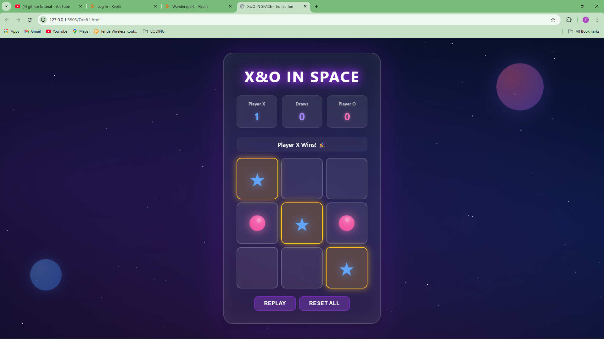

# X&O IN SPACE — Tic Tac Toe

## Author
Akash Choudhary

## Prompt Used
[Prompt.txt](./Prompt.txt)  
(Create a fully deployable, aesthetic Tic Tac Toe game using only a single prompt...)

##Link
 *[https://akashchoudhary221.github.io/TJ-TASK-2025--Akash_Choudhary-/]*

**Credit:**  
- I used **Claude AI** and **Perplexity AI** for summarizing and refining the final one-shot prompt for this project.
- Code was tested and run on **Replit** for rapid iteration and debugging.

## Approach

I set out to build a unique, space-themed Tic Tac Toe game. My process began with a simple, functional board using straightforward HTML, CSS, and JavaScript. After getting the core logic working, I iteratively enhanced my prompt—adding visual elements like stars, nebula effects, animated planets, glassmorphism styling, and dynamic glowing accents. This approach ultimately led to a stylish, modern take on the classic game, all generated from a single, comprehensive AI prompt.

## Algorithm & Features

- Fully front-end, single-file solution: no frameworks or external dependencies.
- Glassmorphism container, neon glow effects, and vivid theme.
- Animated cosmic backgrounds: stars, planets, nebula.
- Interactive, animated scoreboard for Player X, Player O, and Draws.
- 3x3 grid with custom X (star) and O (planet) cell icons, both styled and animated.
- Real-time turn indication; color and status highlighting.
- Winning combination highlights when a player wins.
- "Replay" to reset the board for new games, "Reset All" to clear scores and board.
- Strict move blocking for finished games or filled squares.

## Screenshots

## Deployment

This project is deployed in the same GitHub repository.  
Just open `index.html` locally, or deploy the HTML file to Netlify, Vercel, or any static hosting platform.

## Extra Notes

I enjoyed the “vibe coding” style—being able to focus on creativity rather than deep technical complexity. I also experimented with a fashion landing page using similar AI-driven techniques (link: *[https://akashchoudhary221.github.io/Fashion-technojam/]*)(this was also created with a single prompt). This project involved several rounds of trial and error and debugging within the one-prompt constraint. I even tried some more elaborate designs, but those were beyond the single-prompt challenge.

---

**Thank you for reviewing my submission!**
